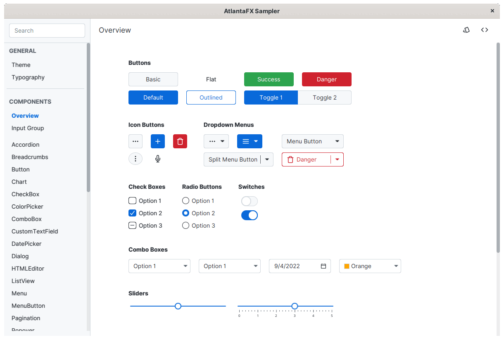

# AtlantaFX



Features:

* Modern flat interface inspired by the variety of Web component frameworks.
* CSS first. It works with existing JavaFX controls.
* Light and dark themes included.
* Simple and intuitive color system based on the [GitHub Primer guidelines](https://primer.style/design/foundations/color).
* Fully customizable. Easily change global accent (brand) color or individual control via looked-up color variables.
* Written in modular SASS. No more digging in 3,500 lines of CSS code.
* Custom themes support. Compile your own theme from existing SASS sources.
* Additional controls that essential for modern GUI development.
* Sampler app:
  * play with themes and fonts
  * test every feature of each existing control and check source code directly in the app to learn how to implement it
  * check color palette and modify theme color contrast
  * hot reload; play with control styles without restarting the whole app
  * showcases that demonstrate real-world project usage

## Try it out

Grab a **[self-updating download of the Sampler app](https://downloads.hydraulic.dev/atlantafx/sampler/download.html)** for Windows, macOS and Linux, packaged with [Conveyor](https://www.hydraulic.software).

## Installing

**Requirements:** JavaFX 17+ (because of `data-url` support).

```xml
<dependency>
    <groupId>io.github.mkpaz</groupId>
    <artifactId>atlantafx-base</artifactId>
    <version>1.0.0</version>
</dependency>
```

Set CSS theme:

```java
Application.setUserAgentStylesheet(new PrimerLight().getUserAgentStylesheet());
Application.setUserAgentStylesheet(new PrimerDark().getUserAgentStylesheet());
// ... find more themes in 'atlantafx.base.theme' package
```

## Build

You can either use CLI or create run configuration in your favorite IDE.

```sh
# compile SASS into styles/dist directory,
# you can stop here and use compiled CSS files just like that
mvn install -pl styles

# compile additional controls, it will also copy previously compiled CSS files
# into the module classpath
mvn install -pl base
```

After building module dependencies you can play with the sampler application. If you just want the demo, run:

```sh
mvn javafx:run -pl sampler
```

If you want to use hot reload (update CSS without restarting sampler) you have to start app in development mode. There's [ATLANTAFX_MODE](https://github.com/mkpaz/atlantafx/blob/master/sampler/src/main/java/atlantafx/sampler/Launcher.java#L45) variable for this. In that mode app won't use CSS from `base` module classpath, but from the `sampler/target/classes/atlantafx/sampler/theme-test` directory. Use `-Pdev` to compile CSS files into that destination.

```sh
# run sampler app in dev mode
mvn javafx:run -pl sampler -Pdev

# run hot reload sass
mvn compile -pl styles -Pdev
```

More details can be found in the source code:

* See [github worklow](https://github.com/mkpaz/atlantafx/blob/master/.github/workflows/tagged-release.yml) for install instructions.

## Motivation

**Goals**:

- SASS

  JavaFX standard themes, namely Modena and Caspian, maintained as a huge single CSS file, which is an overwhelmingly hard task. This alone makes creating a new JavaFX theme from scratch hardly possible. Also JavaFX styling is based on CSS v2.1 specification which does not provide nor variables, nor mixins, nor modules nor any other goodies that are default for modern frontend development. AtlantaFX themes are written on SASS with each component in a separate module and use recent [Dart SASS](https://sass-lang.com/dart-sass) implementation for CSS compilation. It also follows [Github Primer](https://primer.style/design/foundations/color) color system to make creating new themes more simple.

- Additional controls

  JavaFX 2.0 was started in 2011, and it introduced no additional controls since then. Some JavaFX controls are obsolete, some can be found in popular third-party libraries like [ControlsFX](https://github.com/controlsfx/controlsfx). The problem with the latter is that it provides much more than some missing controls. It provides many things that can be called a widget. That's why AtlantaFX borrows some existing controls from ControlsFX instead of supporting it directly. The rule of the thumb is to not re-invent any existing control from `javafx-controls` and to avoid widgets and everything that requires i18n support.

- Sampler application

  Theme development is not possible without some kind of demo application where you can test each control under every angle. That's what the Sampler application is. It supports hot reload, thanks to [cssfx](https://github.com/McFoggy/cssfx), and you can observe the scene graph via [Scenic View](https://github.com/JonathanGiles/scenic-view).

- Distribution and flexibility

  AtlantaFX is also distributed as a collection of CSS files. So, if you don't need additional controls, you can just download only CSS and use it via `Application.setUserAgentStylesheet()` method. If your application is only need a subset of controls, you can compile your own theme by just removing unnecessary components from SASS.

**Non-goals**:

- Replacing `javafx-controls` or standard JavaFX themes

  It's not a goal to re-invent any existing `javafx-controls` component or replace standard JavaFX themes. Libraries come and gone, but committing into the core project benefits all the community.

- Mobile support

  This is a tremendous amount of work. Just use [Gluon Mobile](https://gluonhq.com/products/mobile/).

- Providing theme API

  AtlantaFX provides the Theme interface, which is nothing but a simple wrapper around the stylesheet path. [PR](https://github.com/openjdk/jfx/pull/511) is on its way, let's hope it will ever be merged.
