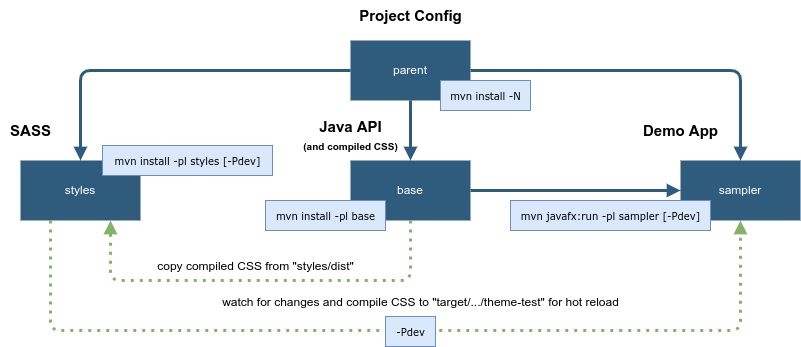

## Project structure



| Directory      | Description                             |
|----------------|-----------------------------------------|
| `.github`      | GitHub Actions workflows                |
| `base`         | additional controls and Java API        |
| `docs`         | GitHub Pages project website            |
| `sampler`      | Sampler application                     |
| `styles`       | theme sources (SASS)                    |

## Instructions

To build and run the whole project, including packaged Sampler [app image](https://docs.oracle.com/en/java/javase/19/docs/specs/man/jpackage.html):

```sh
mvn install
mvn javafx:run -pl sampler
```

If you want to use hot reload (update CSS without restarting the Sampler app), you have to start app in development mode:

```sh
# start watching for SASS source code changes
mvn compile -pl styles -Pdev

# run sampler in dev mode
mvn javafx:run -pl sampler -Pdev
```

You can also build each Maven module individually:

```sh
mvn install -N
mvn install -pl styles
mvn install -pl base
mvn javafx:run -pl sampler
```

### Contributing

If you want to contribute some Java code, you should be aware of two additional checks.

* Maven Checkstyle analysis will be performed automatically. You just need to read Maven output warnings, if any. Installing [checkstyle plugin](https://plugins.jetbrains.com/plugin/1065-checkstyle-idea), which is supported by any IDE, makes it event simpler. Import `checkstyle.xml` to your code style settings to auto-configure project's code formatting and linting.
* To perform Maven ErrorProne plugin analysis, use the corresponding profile.

    ```sh
    mvn compile -Plint
    ```

## Docs

Project documentation is made with [MkDocs](https://squidfunk.github.io/mkdocs-material/). If you want to serve the docs locally to preview some significant changes, you need Python installed. Otherwise, don't worry and just edit the corresponding markdown file(s). GitHub Pages are updated automatically by the GitHub action on each push to the master branch.

```sh
pip install mkdocs-material
cd docs
mkdocs serve
```
