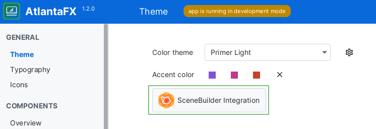

# FXML

AtlantaFX theme is just a user-agent stylesheet, specifically a set of CSS rules that applies to all UI controls. So, nothing prevents it from work with FXML. But RAD tools support is different and sadly SceneBuilder themes (user-agent stylesheets) are hard-coded.

## SceneBuilder Integration

See the corresponding [issue](https://github.com/mkpaz/atlantafx/issues/27).

While SceneBuilder does not support adding custom themes, it is possible to overwrite looked-up CSS paths to make the <ins>existing buttons load custom CSS files</ins>.

**(not yet released)**



### Manual

* Run `mvn package -pl styles` to generate theme package. You can also download it on the [Releases](https://github.com/mkpaz/atlantafx/releases) page.
* Copy `styles/target/AtlantaFX-${version}-scenebuilder.zip` to the SceneBuilder `app/` directory (e.g. `%HOMEPATH%/Local/SceneBuilder/app/` on Windows) or another directory depending on where you installed SceneBuilder application on your PC.
* Open `SceneBuilder.cfg` in the SceneBuilder app directory and add the ZIP file to the beginning of the `app.classpath` variable, e.g.:

    ```text
    # beware about file separator (slash or backslash) depending on your OS
    app.classpath=$APPDIR\AtlantaFX-${version}-scenebuilder.zip:$APPDIR\scenebuilder-18.0.0-all.jar
    ```

* Restart SceneBuilder.

Then you can select AtlantaFX themes in the menu `Preview -> Themes -> Caspian Embedded (FX2)`. The themes are mapped as follows:

| SceneBuilder                | Caspian High Contrast (FX2) | AtlantaFX Theme |
|-----------------------------|-----------------------------|-----------------|
| Caspian Embedded (FX2)      | disabled                    | Primer Light    |
| Caspian Embedded (FX2)      | enabled                     | Primer Dark     |
| Caspian Embedded QVGA (FX2) | disabled                    | Nord Light      |
| Caspian Embedded QVGA (FX2) | enabled                     | Nord Dark       |
