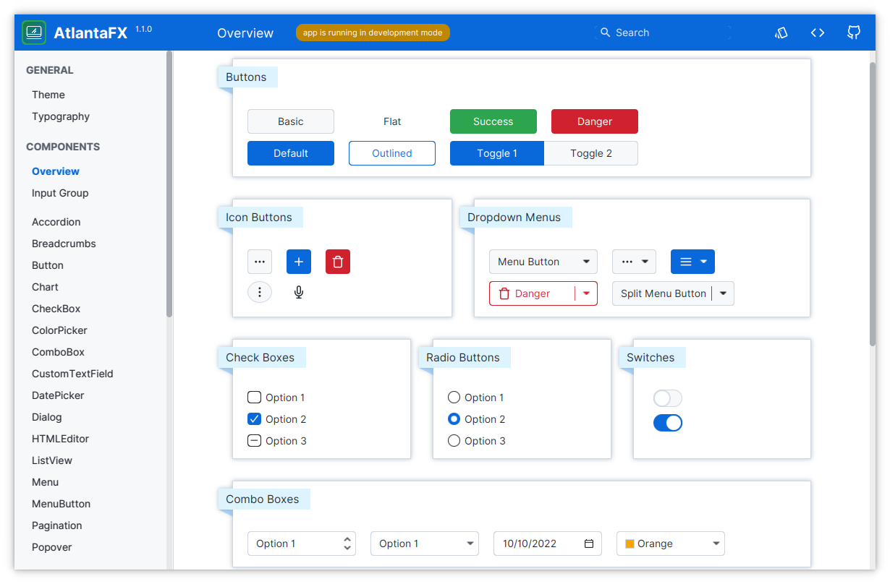
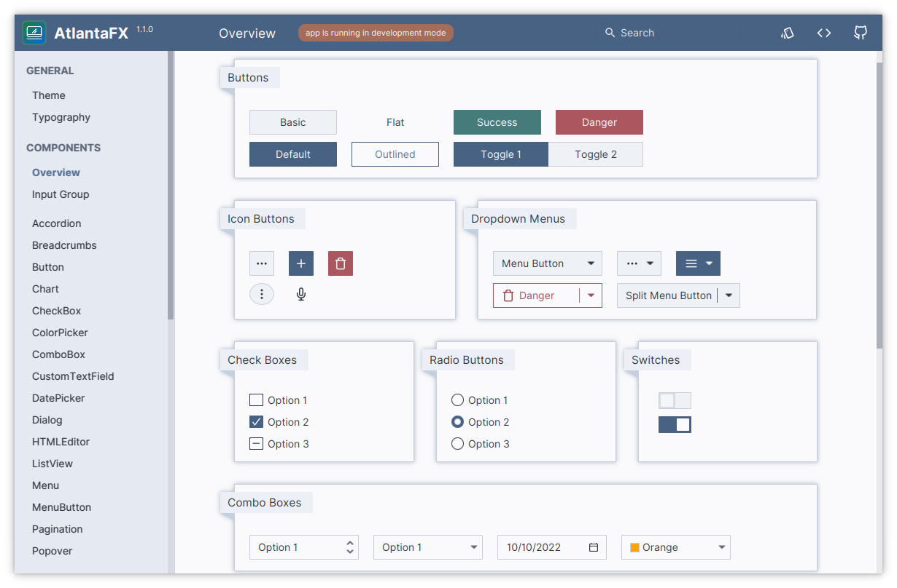
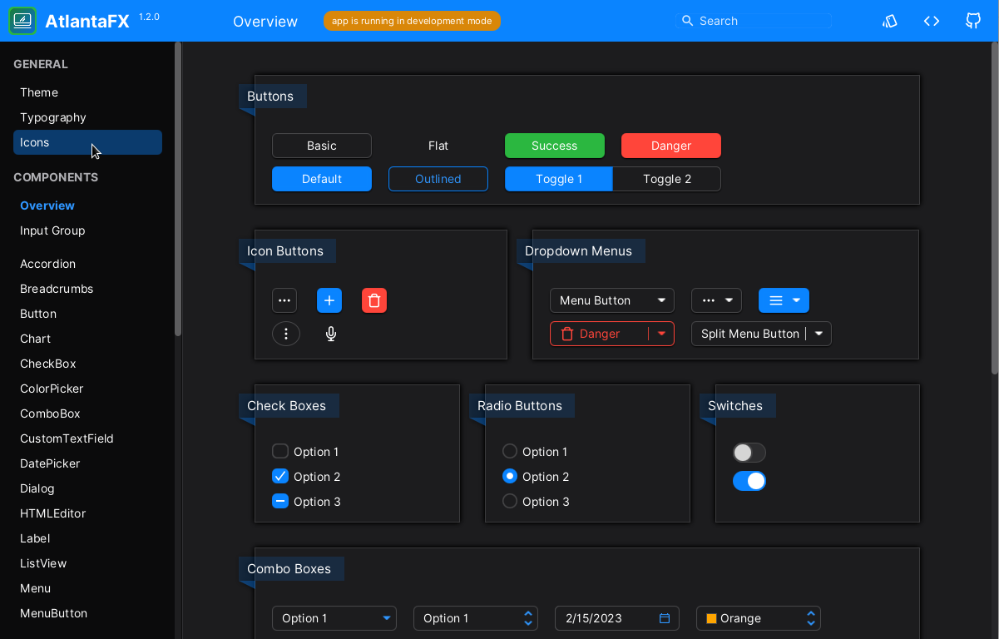

# Overview

Modern JavaFX CSS theme collection with additional controls.

* Flat interface inspired by the variety of Web component frameworks.
* CSS first! It works with existing JavaFX controls.
* Two themes in both light and dark variants.
* Simple and intuitive color system based on the [GitHub Primer guidelines](https://primer.style/design/foundations/color).
* Fully customizable. Easily change global accent (brand) color or individual control via looked-up color variables.
* Written in modular [SASS](https://sass-lang.com/). No more digging in 3,500 lines of CSS code.
* [Custom themes support](theming.md). Compile your own theme from existing SASS sources.
* Additional controls for modern GUI development.
* Beautiful demo app:
    * Preview all supported themes.
    * Test every feature of each existing control and check source code directly in the app to learn how to implement it.
    * Check color palette and modify theme color contrast.
    * Hot reload. Play with control styles without restarting the whole app.
    * Showcases to demonstrate real-world project usage.

## Try It Out

Grab a **[self-updating download of the Sampler app](https://downloads.hydraulic.dev/atlantafx/sampler/download.html)** for Windows, macOS and Linux, packaged with [Conveyor](https://www.hydraulic.software).

Or download the latest build on the [releases page](https://github.com/mkpaz/atlantafx/releases).

## Related Links

* [Source Code](https://github.com/mkpaz/atlantafx)
* [Bug Tracker](https://github.com/mkpaz/atlantafx/issues)
* [Sample Theme](https://github.com/mkpaz/atlantafx-sample-theme) (find more info in [Theming](theming.md) section)

## Themes

<figure markdown>
  { width="800" }
  <figcaption>Primer Light</figcaption>
</figure>

<figure markdown>
  { width="800" }
  <figcaption>Primer Dark</figcaption>
</figure>

<figure markdown>
  { width="800" }
  <figcaption>Nord Light</figcaption>
</figure>

<figure markdown>
  { width="800" }
  <figcaption>Nord Dark</figcaption>
</figure>

<figure markdown>
  { width="800" }
  <figcaption>Cupertino Light</figcaption>
</figure>

<figure markdown>
  { width="800" }
  <figcaption>Cupertino Dark</figcaption>
</figure>

<figure markdown>
  { width="800" }
  <figcaption>Dracula</figcaption>
</figure>