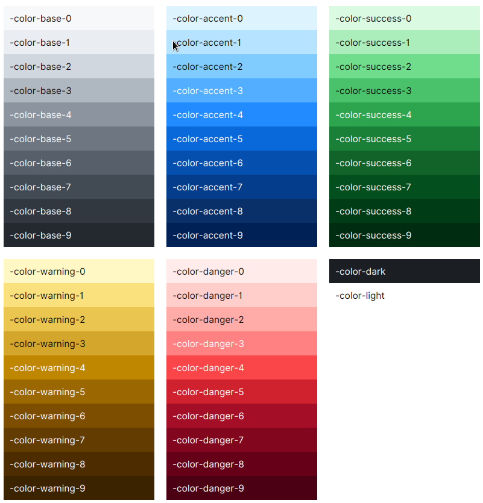

# Global Colors

Global variables are defined at the Scene root level. You can preview all of them in the Sampler app on `Theme` page.

AtlantaFX is based on GitHub Primer color system. You can check [GitHub Primer interface guidelines](https://primer.style/design/foundations/color) for more detailed instructions. There are functional color variables and color scale variables.

## Functional Colors

### Foreground Colors

| Color                | Usage                                                                                                                            |
|----------------------|----------------------------------------------------------------------------------------------------------------------------------|
| `-color-fg-default`  | Primary color for text and icons. It should be used for body content, titles and labels.                                         |
| `-color-fg-muted`    | For content that is secondary or that provides additional context but is not critical to understanding the flow of an interface. |
| `-color-fg-subtle`   | For placeholders or decorative foregrounds.                                                                                      |
| `-color-fg-emphasis` | The text color designed to combine with `*-emphasis` backgrounds for optimal contrast.                                           |

### Background Colors

| Color               | Usage                                                              |
|---------------------|--------------------------------------------------------------------|
| `-color-bg-default` | Primary background color.                                          |
| `-color-bg-overlay` | Background color for popup controls such as popovers and tooltips. |
| `-color-bg-subtle`  | Provides visual rest and contrast against the default background.  |
| `-color-bg-inset`   | For a focal point, such as in conversations or activity feeds.     |

### Border Colors

| Color                   | Usage                                                                        |
|-------------------------|------------------------------------------------------------------------------|
| `-color-border-default` | Default color to create bounds around content.                               |
| `-color-border-muted`   | For dividers to emphasize the separation between items, columns or sections. |
| `-color-border-subtle`  | Faint border color.                                                          |
| `-color-shadow-default` | Color for creating shadow effects around controls.                           |

### Accent Colors

The below colors are all accent colors. Use them according to their role. The variable names are self-explaining.

Neutral colors. Use to highlight content without any added meaning.

* `-color-neutral-emphasis-plus`
* `-color-neutral-emphasis`
* `-color-neutral-muted`
* `-color-neutral-subtle`

Accent (or primary/brand) color. Use to draw attention to the particular area or component.

* `-color-accent-fg`
* `-color-accent-emphasis`
* `-color-accent-muted`
* `-color-accent-subtle`

Success colors. Use to express the completion or positive outcome of a task.

* `-color-success-fg`
* `-color-success-emphasis`
* `-color-success-muted`
* `-color-success-subtle`

Attention colors. Use to warn of pending tasks or highlight active content.

* `-color-warning-fg`
* `-color-warning-emphasis`
* `-color-warning-muted`
* `-color-warning-subtle`

Danger colors. Use to inform of error or another negative message.

* `-color-danger-fg`
* `-color-danger-emphasis`
* `-color-danger-muted`
* `-color-danger-subtle`

*Note that functional color values are not always picked from the color palette. They can have its own unique value, e.g. to add opacity.*

### Chart Colors

Chart colors are named as `-color-chart-[1-8]` and are used, well, for charts. The reason they are defined as global variables is to allow them to be used in controls that do not have `.chart` class, e.g. for drawing or diagrams.

## Color Scale

Generally, scale variables only supposed to be used by theme devs as a replacement of dynamic brightness calculation functions. Avoid referencing them directly when building UI that needs to adapt to different color themes. Instead, use the functional variables listed above. All legitimate functional color combinations are guaranteed to look good in all color themes, because they need to maintain a certain amount of contrast. In rare cases, you may need to use scale variables to define custom functional variables in your application.

Each color scale consists of 10 shades from 0 to 9.

* `-color-dark`
* `-color-light`
* `-color-base-[0-9]`
* `-color-accent-[0-9]`
* `-color-success-[0-9]`
* `-color-warning-[0-9]`
* `-color-danger-[0-9]`

