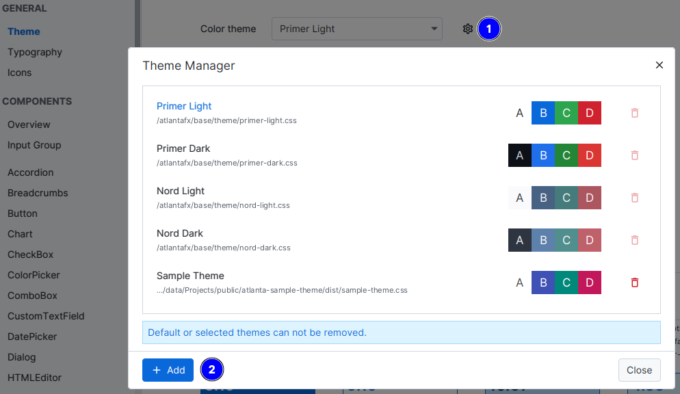

# Theming

AtlantaFX uses *looked-up colors*. Each color property starts with `-color-*` prefix. There're [global colors](reference/global-colors.md), that are defined at the Scene root level and *individual controls colors* (check the corresponding control reference for the info).

!!! note "What's looked-up color?"

    `TL;DR`: It's a *color variable*.

    As any other CSS property looked-up colors resolved according to CSS specificity rules. If you imagine the following hierarchy:

    ```text
    Scene [class = root]
        Region [class = r1]
            Region [class = r2]
                Region [class = r3]
    ```

    We can manipulate the background color of each descending node with the following CSS rules (most specific wins):

    ```css
    .root         { -color-background: transparent;          }
    .r1, .r2, .r3 { -fx-background-color: -color-background; }
    .r2           { -color-background: red;  } /* applied to the r2 and below */
    .r2 > .r3     { -color-background: green;}
    ```

    JavaFX will try to resolve color variable value starting from the most to the least specific rule, which is always the root of the Scene hierarchy.

    Result:

    ```text
    r1 - transparent
    r2 - red
    r3 - green
    ```

All stylesheets are written in [SASS](https://sass-lang.com/documentation/) and compiled to CSS by using a very handy [sass-cli-maven-plugin](https://github.com/HebiRobotics/sass-cli-maven-plugin). You don't have to learn SASS, though it's a very simple language if you're already familiar with CSS.

!!! tip

    Theme is not limited by colors. If you only want to change global colors, all you need is to override default looked-up color variables. The easiest way is to utilize pseudo-class, so you can always return to the default color scheme.

    ```css
    .root:custom-theme {
        -color-bg-default: #123456;
        /* ... and so on */
    }
    ```

    ```java
    // declare pseudo-class
    private static PseudoClass CUSTOM_THEME = PseudoClass.getPseudoClass("custom-theme");
    // then apply it to the root node
    getScene().getRoot().pseudoClassStateChanged(CUSTOM_THEME, true);
    ```

## Compilation

You can find ready to use custom theme template in the [`atlantafx-sample-theme`](https://github.com/mkpaz/atlantafx-sample-theme) repository.

* Clone the sample repository.

    ```sh
    git clone https://github.com/mkpaz/atlantafx-sample-theme
    ```

* Compile it.

    ```sh
    cd atlantafx-sample-theme
    mvn compile [-Pwatch] # (optionally) watch for changes
    ```

* Grab resulting CSS from `dist/` directory and connect it to your application.

    ```java
    Application.setUserAgentStylesheet(/* path to the CSS file */);
    ```

## Modification

Each SCSS file in the source directory is nothing but a separate SASS module that can be imported by other files. You can find a bunch of SASS variables at the top of a file. If variable is marked as `!default`, it can be changed during theme compilation.

In fact, any AtlantaFX theme can be used as an example. They all share the common sources and use SASS variable modification to compile the different stylesheets.

!!! tip
    If you want to customize a style property that is not exposed as SASS variable, don't hesitate to open an [issue](https://github.com/mkpaz/atlantafx/issues) or send a [PR](https://github.com/mkpaz/atlantafx/pulls).

!!! warning
    Note that SASS is only loading any module (file) just once, so **customization order does matter**. E.g. if A module imports B and B imports C then we have to override C variables first, then B, then A. Otherwise, there will be an exception that we are attempting to change a variable in a module that has been already loaded.

Example:

```sass
// Color customization.
@forward "relative/path/to/settings/color-vars" with (
    //   ...
);

// Shared property customization.
@forward "relative/path/to/settings/config" with (
    //   ...
);

// This should precede controls customization, as it guarantees
// that .root styles precede components styles.
@use "general";

// Individual component property customization.
// Use "as name-*" to avoid conflicts if two or more SASS modules
// contain variables with the same name.
@forward "relative/path/to/components/split-pane" as split-pane-*  with (
    //   ...
);
```

## Color Contrast

If you want to develop a good theme, there are some accessibility rules. Color contrast between text and its background must meet required [WCAG standards](https://www.w3.org/WAI/WCAG21/Understanding/contrast-minimum.html). The contrast requirements are:

* `4.5:1` for normal text
* `3:1` for large text (>24px)
* `3:1` for UI elements and graphics
* No contrast requirement for decorative and disabled elements

You can check and modify color contrast directly in the Sampler app.


Click on any block to run contrast checker and get more detailed info.


## Testing

You can use Sampler app to test and develop your custom theme. Including hot reload, of course.

Start Sampler app in development mode (check [build instructions](build.md) for more info). If you downloaded packaged Sampler app, you can do that by setting `ATLANTAFX_MODE=dev` env variable.

Go to the `Theme` page and add your CSS file.


