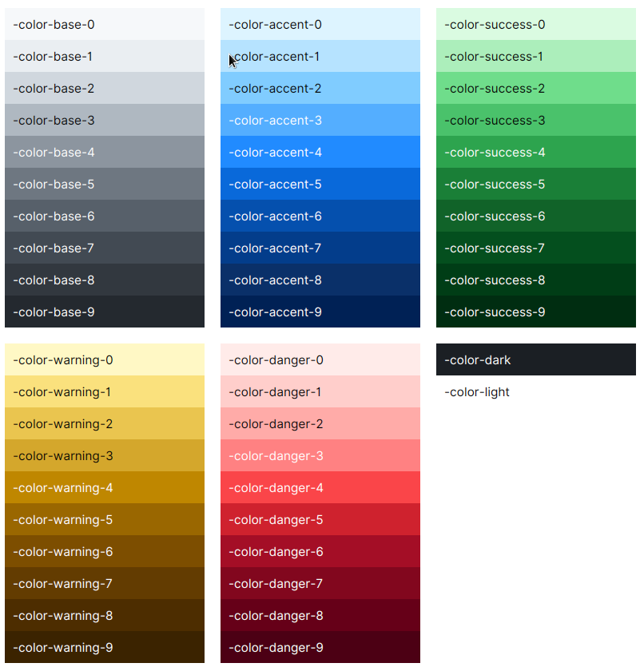
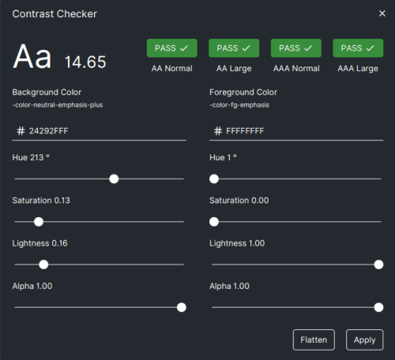

# STYLES

This module contains a collection of CSS themes, aka *User Agent Stylesheets* in JavaFX terms.

All stylesheets are written in [SASS](https://sass-lang.com/documentation/) and compiled to CSS
using a very handy [sass-cli-maven-plugin](https://github.com/HebiRobotics/sass-cli-maven-plugin).
You don't have to learn SASS, although it's a very simple language if you're already familiar
with CSS.

## Table of Contents

- [Global Colors](#global-colors)
- [Typography](#typography)
- [Theming](#theming)
- [Controls Reference](#controls-reference)

## Global Colors

Global variables are defined at the Scene root level. You can preview all of them in the Sampler
app on the `Theme` page.

AtlantaFX is based on the GitHub Primer color system. There are functional color variables and
color scale variables.

### Functional Colors

#### Foreground Colors

| Color | Usage |
| --- | --- |
| `-color-fg-default` | Primary color for text and icons. It should be used for body<br>content, titles, and labels. |
| `-color-fg-muted` | For content that is secondary or provides additional context but is<br>not critical to understanding the flow of an interface. |
| `-color-fg-subtle` | For placeholders or decorative foregrounds. |
| `-color-fg-emphasis` | The text color designed to combine with `*-emphasis` backgrounds<br>for optimal contrast. |

#### Background Colors

| Color | Usage |
| --- | --- |
| `-color-bg-default` | Primary background color. |
| `-color-bg-overlay` | Background color for popup controls such as popovers and tooltips. |
| `-color-bg-subtle` | Provides visual rest and contrast against the default background. |
| `-color-bg-inset` | For a focal point, such as in conversations or activity feeds. |

#### Border Colors

| Color | Usage |
| --- | --- |
| `-color-border-default` | Default color to create bounds around content. |
| `-color-border-muted` | For dividers to emphasize the separation between items, columns, or<br>sections. |
| `-color-border-subtle` | Faint border color. |
| `-color-shadow-default` | Color for creating shadow effects around controls. |

#### Accent Colors

The colors below are all accent colors. Use them according to their role. The variable names are self-explanatory.

Neutral colors. Use to highlight content without any added meaning:

- `-color-neutral-emphasis-plus`
- `-color-neutral-emphasis`
- `-color-neutral-muted`
- `-color-neutral-subtle`

Accent (or primary/brand) color. Use to draw attention to a particular area or component:

- `-color-accent-fg`
- `-color-accent-emphasis`
- `-color-accent-muted`
- `-color-accent-subtle`

Success colors. Use to express the completion or positive outcome of a task:

- `-color-success-fg`
- `-color-success-emphasis`
- `-color-success-muted`
- `-color-success-subtle`

Attention colors. Use to warn of pending tasks or highlight active content:

- `-color-warning-fg`
- `-color-warning-emphasis`
- `-color-warning-muted`
- `-color-warning-subtle`

Danger colors. Use to inform of errors or other negative messages:

- `-color-danger-fg`
- `-color-danger-emphasis`
- `-color-danger-muted`
- `-color-danger-subtle`

*Note that functional color values are not always picked from the color palette.
They can have their own unique values, e.g., to add opacity.*

#### Chart Colors

Chart colors are named as `-color-chart-[1-8]` and are used, naturally, for charts. The reason
they are defined as global variables is to allow them to be used in controls that do not have
the `.chart` class, e.g., for drawing or diagrams.

### Color Scale

Generally, scale variables are only supposed to be used by theme developers as a replacement
for dynamic brightness calculation functions. Avoid referencing them directly when building UI
that needs to adapt to different color themes. Instead, use the functional variables listed above.
All legitimate functional color combinations are guaranteed to look good in all color themes
because they maintain a certain amount of contrast. In rare cases, you may need to use scale
variables to define custom functional variables in your application.

Each color scale consists of 10 shades from 0 to 9:

- `-color-dark`
- `-color-light`
- `-color-base-[0-9]`
- `-color-accent-[0-9]`
- `-color-success-[0-9]`
- `-color-warning-[0-9]`
- `-color-danger-[0-9]`



## Typography

AtlantaFX doesn't include any fonts, as it uses the operating system font family.

The default font size is `14px` (`~= 11pt`). You're free to change it, but note that all stylesheets
are tested with the default font size only, so some controls may break with this change.

Font size:

- `title-1`
- `title-2`
- `title-3`
- `title-4`
- `text-caption`
- `text-small`

Font color:

*Note that accent color support requires two CSS styles in order to reuse existing class names.*

- `text`, `accent`
- `text`, `success`
- `text`, `warning`
- `text`, `danger`
- `text-muted`
- `text-subtle`

Font weight:

> [!WARNING]
> JavaFX only supports bold or regular font weight. Other values are recognized by the CSS parser,
> but reduced to one of them.

- `text-bold`
- `text-bolder`
- `text-normal`
- `text-lighter`

Font style:

- `text-italic`
- `text-oblique`
- `text-underlined`
- `text-strikethrough`

## Theming

AtlantaFX uses *looked-up colors*. Each color property starts with the `-color-*` prefix. There are
[global colors](#global-colors), which are defined at the Scene's root level, and individual control
colors (check the corresponding control reference for more information).

> [!NOTE] What's a looked-up color?
>
> `TL;DR`: It's a *color variable*.
>
> As with any other CSS property, looked-up colors are resolved according to CSS specificity rules.
> Consider the following hierarchy:
>
> ```text
> Scene [class = root]
>     Region [class = r1]
>         Region [class = r2]
>             Region [class = r3]
> ```
>
> We can manipulate the background color of each descendant node with the following CSS rules
> (most specific wins):
>
> ```css
> .root         { -color-background: transparent;          }
> .r1, .r2, .r3 { -fx-background-color: -color-background; }
> .r2           { -color-background: red;  } /* applied to the r2 and below */
> .r2 > .r3     { -color-background: green;}
> ```
>
> JavaFX will try to resolve the color variable value starting from the most specific rule
> to the least specific one, the latter being always the root of the Scene hierarchy.
>
> Result:
>
> ```text
> r1 - transparent
> r2 - red
> r3 - green
> ```

A theme is not limited to colors. If you only want to change the global colors, all you need to do
is override the default looked-up color variables. The easiest way is to use a pseudo-class,
so that you can always revert to the default color scheme.

```css
.root:custom-theme {
  -color-bg-default: #123456;
  /* ... and so on */
}
```

```java
// declare a pseudo-class
private static final PseudoClass CUSTOM_THEME = PseudoClass.getPseudoClass("custom-theme");
// ... and apply it to the root node
getScene().getRoot().pseudoClassStateChanged(CUSTOM_THEME, true);
```

### Compilation

You can find a ready-to-use custom theme template in the [`atlantafx-sample-theme`](https://github.com/mkpaz/atlantafx-sample-theme)
repository.

- Clone the sample repository.

    ```sh
    git clone https://github.com/mkpaz/atlantafx-sample-theme
    ```

- Compile it.

    ```sh
    cd atlantafx-sample-theme
    mvn compile [-Pwatch] # (optionally) watch for changes
    ```

- Grab the resulting CSS from the `dist/` directory and add it to your application.

    ```java
    Application.setUserAgentStylesheet(/* path to the CSS file */);
    ```

### Modification

Each SCSS file in the source directory is nothing but a separate SASS module that can be imported
by other files. You can find a bunch of SASS variables at the top of a file. If a variable is
marked as `!default`, it can be changed during theme compilation.

In fact, any AtlantaFX theme can be used as an example. They all share common sources and use SASS
variable overrides to compile the different stylesheets.

If you want to customize a style property that is not exposed as a SASS variable, don't hesitate
to open an [issue](https://github.com/mkpaz/atlantafx/issues) or send a
[PR](https://github.com/mkpaz/atlantafx/pulls).

> [!WARNING]
> Note that SASS loads any module (file) only once, so **customization order does matter**.
> E.g., if module A imports B and B imports C, then we have to override C's variables first,
> then B's, then A's. Otherwise, there will be an exception saying that we are attempting to
> change a variable in a module that has already been loaded.

Example:

```sass
// Color customization.
@forward "relative/path/to/settings/color-vars" with (
    //   ...
);

// Shared property customization.
@forward "relative/path/to/settings/config" with (
    //   ...
);

// This should precede control customization, as it guarantees
// that .root styles precede component styles.
@use "general";

// Customization of individual component properties.
// Use "as name-*" to avoid conflicts if two or more SASS modules
// contain variables with the same name.
@forward "relative/path/to/components/split-pane" as split-pane-*  with (
    //   ...
);
```

### Color Contrast

If you want to develop a good theme, there are some accessibility rules to follow.
Color contrast between text and its background must meet the required
[WCAG standards](https://www.w3.org/WAI/WCAG21/Understanding/contrast-minimum.html).
The contrast requirements are:

- `4.5:1` for normal text
- `3:1` for large text (>24px)
- `3:1` for UI elements and graphics
- No contrast requirement for decorative and disabled elements

You can check and modify color contrast directly in the Sampler app.

Click on any block to run a contrast checker and get more detailed information.



### Testing

You can use the Sampler app to test and develop your custom theme, including hot reload, of course.

Start the Sampler app in development mode (check the [build instructions](build.md) for more
information). If you downloaded the packaged Sampler app, you can do that by setting the
`ATLANTAFX_MODE=dev` environment variable.

Go to the `Theme` page and add your CSS file.

## Controls Reference

This reference lists all supported custom CSS classes and color variables.

Standard options are described in the [JavaFX CSS Reference](https://openjfx.io/javadoc/19/javafx.graphics/javafx/scene/doc-files/cssref.html).

### Accordion

The same as [`TitledPane`](#titledpane).

### Breadcrumbs

No style variables are supported at the moment.

### Button

CSS classes:

- `accent`, `success`, `danger` (accent color support)
- `button-circle`
- `button-icon`
- `button-outlined`
- `flat`
- `left-pill`, `center-pill`, `right-pill` (input group support)
- `rounded`
- `small`, `large` (size support)

Color variables:

- `-color-button-bg`
- `-color-button-fg`
- `-color-button-border`
- `-color-button-bg-hover`
- `-color-button-fg-hover`
- `-color-button-border-hover`
- `-color-button-bg-focused`
- `-color-button-fg-focused`
- `-color-button-border-focused`
- `-color-button-bg-pressed`
- `-color-button-fg-pressed`
- `-color-button-border-pressed`

### Card

No style variables are supported at the moment.

### Chart

No style variables are supported at the moment.

### CheckBox

No style variables are supported at the moment.

### ColorPicker

No style variables are supported at the moment.

### ChoiceBox

CSS classes:

- `.alt-icon` (tweak)
- `left-pill`, `center-pill`, `right-pill` (input group support)
- `small`, `large` (size support)

Pseudo-classes:

- `:success`, `:danger`

### ComboBox

The same as [`ChoiceBox`](#choicebox).

### Data Iterators

This includes all virtualized controls such as `ListView`, `TreeView`, `TableView`, and
`TreeTableView`.

> [!WARNING]
> The default cell height is fixed. Set `-fx-cell-size: -1` CSS property to use cell height
> based on content.

CSS classes:

- `.dense`
- `.edge-to-edge` (tweak)

Color variables:

- `-color-cell-bg`
- `-color-cell-fg`
- `-color-cell-bg-selected`
- `-color-cell-fg-selected`
- `-color-cell-bg-selected-focused`
- `-color-cell-fg-selected-focused`
- `-color-cell-bg-odd`
- `-color-cell-border`

#### TableView

CSS classes:

- `align-left`, `align-center`, `align-right` (column alignment must be applied to the `TableColumn`)
- `.bordered`
- `.striped`

Color variables:

- `-color-header-bg`
- `-color-header-fg`

#### TreeView

CSS classes:

- `.alt-icon` (tweak)

Color variables:

- `-color-disclosure`

#### TreeTableView

Inherits all [TableView](#tableview) and [TreeView](#treeview) CSS classes and variables.

### DatePicker

Color variables:

- `-color-date-bg`
- `-color-date-border`
- `-color-date-month-year-bg`
- `-color-date-month-year-fg`
- `-color-date-day-bg`
- `-color-date-day-bg-hover`
- `-color-date-day-bg-selected`
- `-color-date-day-fg`
- `-color-date-day-fg-hover`
- `-color-date-day-fg-selected`
- `-color-date-week-bg`
- `-color-date-week-fg`
- `-color-date-today-bg`
- `-color-date-today-fg`
- `-color-date-other-month-fg`
- `-color-date-chrono-fg`

### HTMLEditor

No style variables are supported at the moment.

### Hyperlink

Color variables:

- `-color-link-fg`
- `-color-link-fg-visited`
- `-color-link-fg-armed`

### Label

CSS classes:

- `accent`, `success`, `warning`, `danger`, `text-muted`, `text-subtle` (text color support)
- `left-pill`, `center-pill`, `right-pill` (input group support)
- `small`, `large` (size support)

Pseudo-classes:

- `:accent`, `:success`, `:warning`, `:danger` (text color support)

### MenuButton

CSS classes:

- `accent`, `success`, `danger` (accent color support)
- `button-icon`
- `button-outlined`
- `flat`
- `left-pill`, `center-pill`, `right-pill` (input group support)
- `no-arrow` (tweak)

Color variables:

- `-color-button-bg`
- `-color-button-fg`
- `-color-button-border`
- `-color-button-bg-hover`
- `-color-button-fg-hover`
- `-color-button-border-hover`
- `-color-button-bg-focused`
- `-color-button-fg-focused`
- `-color-button-border-focused`
- `-color-button-bg-pressed`
- `-color-button-fg-pressed`
- `-color-button-border-pressed`

### MenuBar

No style variables are supported at the moment.

### Message

CSS classes:

- `accent`, `success`, `warning`, `danger` (accent color support)

Color variables:

- `-color-message-bg`
- `-color-message-fg-primary`
- `-color-message-fg-secondary`
- `-color-message-border`
- `-color-message-button-hover`
- `-color-message-border-interactive`

### ModalPane

Color variables:

- `-color-modal-pane-overlay`

### Notification

CSS classes:

- `accent`, `success`, `warning`, `danger` (accent color support)

Color variables:

- `-color-notify-bg`
- `-color-notify-fg`
- `-color-notify-bg-hover`
- `-color-notify-fg-hover`
- `-color-notify-border`
- `-color-notify-border-intent`

### Pagination

CSS classes:

- `.bullet` (`Pagination.STYLE_CLASS_BULLET`)

### Popover

No style variables are supported at the moment.

### ProgressBar

Color variables:

- `-color-progress-bar-track`
- `-color-progress-bar-fill`

### RadioButton

No style variables are supported at the moment.

### RingProgressIndicator

Color variables:

- `-color-progress-indicator-track`
- `-color-progress-indicator-fill`

### ScrollPane

No style variables are supported at the moment.

### SegmentedControl

Color variables:

- `-color-segment-bg`
- `-color-segment-fg`
- `-color-segment-border`
- `-color-segment-fg-hover`
- `-color-segment-bg-selected`
- `-color-segment-fg-selected`
- `-color-segment-border-selected`

### SelectableText

Color variables:

- `-fx-highlight-fill`
- `-fx-highlight-stroke`
- `-fx-highlight-text-fill`

### Separator

Color variables:

- `-color-separator`

### Sidebar

Color variables:

- `-color-sidebar-bg`
- `-color-sidebar-fg`
- `-color-sidebar-fg-section`
- `-color-sidebar-fg-icon`
- `-color-sidebar-border`
- `-color-sidebar-bg-hover`
- `-color-sidebar-fg-hover`
- `-color-sidebar-fg-icon-hover`
- `-color-sidebar-bg-focused`
- `-color-sidebar-fg-focused`
- `-color-sidebar-border-focused`
- `-color-sidebar-bg-selected`
- `-color-sidebar-fg-selected`
- `-color-sidebar-border-selected`
- `-color-sidebar-bg-selected-within`
- `-color-sidebar-fg-selected-within`
- `-color-sidebar-border-selected-within`

### Slider

CSS classes

- `small`, `large` (size support)

Color variables:

- `-color-slider-thumb`
- `-color-slider-thumb-border`
- `-color-slider-track`
- `-color-slider-track-progress`
- `-color-slider-tick`

### Spin

Color variables:

- `-spin-color-primary`
- `-spin-color-secondary`
- `-spin-color-tertiary`

### Spinner

No style variables are supported at the moment.

### SplitMenuButton

The same as [`MenuButton`](#menubutton).

### SplitPane

Color variables:

- `-color-split-divider`
- `-color-split-divider-pressed`
- `-color-split-grabber`
- `-color-split-grabber-pressed`

### TabLine

Same as `TabPane`.

### TabPane

CSS classes:

- `.dense`
- `.floating` (`TabPane.STYLE_CLASS_FLOATING` or `Styles.TABS_FLOATING`)
- `.classic` (`Styles.TABS_CLASSIC`)

Floating and classic styles are mutually exclusive.

Color variables:

- `-color-tab-bg-selected`
- `-color-tab-fg-selected`
- `-color-tab-border-selected`

To apply these variables, ensure that your custom CSS rule has more specificity, e.g.:

```css
.my-tab-pane.floating {
    -color-tab-fg-selected: red;
}
```

### TextInput

This includes all text controls such as `TextField`, `TextArea`, `PasswordField` and `CustomTextField`.

CSS classes:

- `left-pill`, `center-pill`, `right-pill` (input group support)
- `rounded`
- `small`, `large` (size support)

Pseudo-classes:

- `:success`, `:danger`

Color variables:

- `-color-input-bg`
- `-color-input-fg`
- `-color-input-border`
- `-color-input-bg-focused`
- `-color-input-border-focused`
- `-color-input-bg-highlight`
- `-color-input-fg-highlight`

### Tile

No style variables are supported at the moment.

### TitledPane

Also applied to the [Accordion](#accordion).

CSS classes:

- `.alt-icon` (tweak)
- `.dense`
- `.elevated-1`, `.elevated-2`, `.elevated-3`, `.elevated-4`, `.interactive` (elevation support)

### ToggleButton

CSS classes:

- `flat`
- `small`, `large` (size support)

Color variables:

- `-color-button-bg-selected`
- `-color-button-fg-selected`

### ToggleSwitch

Pseudo-classes:

- `:success`, `:danger`

### Toolbar

No style variables are supported at the moment.

### Tooltip

No style variables are supported at the moment.
