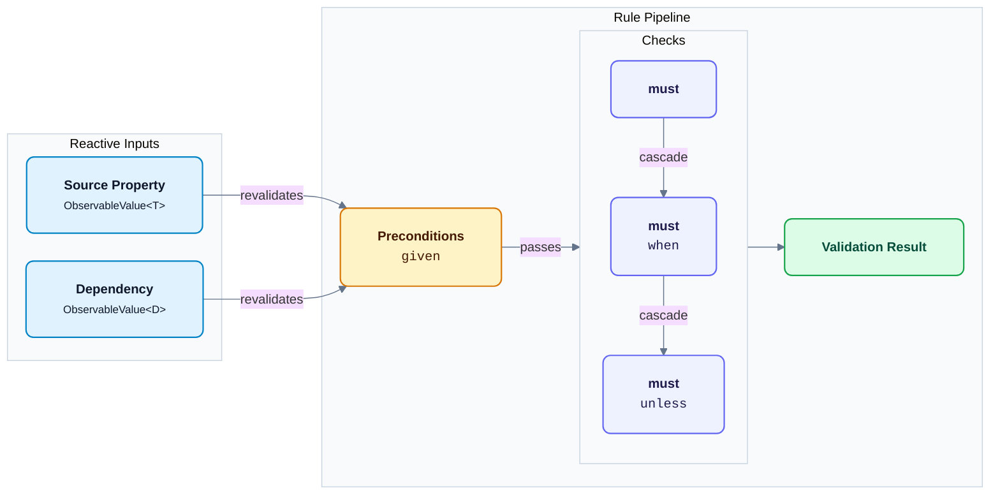
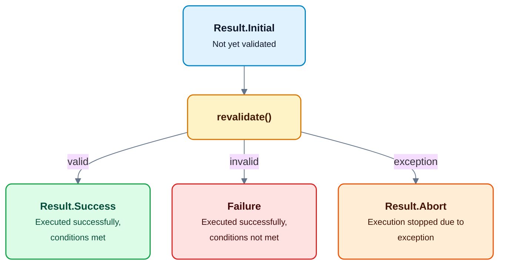

# Validation

A lightweight, fluent validation API designed for JavaFX applications.

## Quick Start

This subproject does not depend on any other AtlantaFX module.

```xml
<dependency>
    <groupId>io.github.mkpaz</groupId>
    <artifactId>atlantafx-validation</artifactId>
    <version>TBD</version>
</dependency>
```

Gradle:

```groovy
repositories {
    mavenCentral()
}

dependencies {
    implementation 'io.github.mkpaz:atlantafx-validation:TBD'
}
```

See the demo applications in the [examples](https://github.com/mkpaz/atlantafx/tree/master/examples) directory.

```java
Rule.on(usernameField.textProperty(), "Username")
    .must(Strings.isNotBlank())
    .failMessage("Username is required.")
    .must(Strings.lengthGreaterOrEqual(3))
    .failMessage("Username must be at least 3 characters.")
    .onValidated(new TextAction(usernameErrorLabel));
```

## API Overview

A `Rule` performs validation on a single observable property:

```text
Rule.on(property)                        // Creates a rule for an observable property
Rule.on(property, "Field Name")          // Creates a named rule for an observable property
must(predicate)                          // Adds a validation check (chain as many as needed)
when(predicate) / unless(predicate)      // Skips the preceding check if the condition (not)matches
failCode(code)                           // Sets an integer error code (or severity) for the preceding check
failMessage(message)                     // Sets a plain error message for the preceding check
failMessageFormat(pattern)               // Sets a formatted error message for the preceding check
failMessageKey(bundle, key)              // Sets a ResourceBundle error message for the preceding check
immediate()                              // Revalidates the rule automatically on source property changes
revalidate()                             // Triggers validation manually and returns the result
cascade(Cascade.STOP)                    // Stops remaining checks on the first failure
childRules(rule1, rule2)                 // Attaches child rules that revalidate with the parent rule
given(predicate)                         // Sets a precondition required before running must() checks
given(observable, predicate)             // Sets an observable precondition required before must() checks
attribute("key", value)                  // Attaches metadata for use in callbacks or error messages
onSuccess(handler)                       // Runs a callback when validation succeeds
onFailure(handler)                       // Runs a callback when validation fails
onException(handler)                     // Runs a callback if an exception stops validation
doFinally(handler)                       // Runs a callback after validation finishes regardless of the result
onValidated(action)                      // Shortcut for onSuccess(handler) + onFailure(handler) 
resultProperty()                         // Returns the validation result as an observable property
observeValid() / observeInvalid()        // Returns the validity state as an observable property
subscribe(consumer)                      // Subscribes a listener to result updates
```

`RuleSet` groups multiple rules together.

```text
RuleSet.of(rule1, rule2)                 // Combines multiple rules into a set
RuleSet.of("Login Form", rule1, rule2)   // Combines multiple rules into a named set
immediate()                              // Updates the combined result automatically when any rule changes
revalidate()                             // Triggers revalidation for all rules in the set
cascade(Cascade.CONTINUE)                // Continues validating next rules even if a rule fails
attribute("key", value)                  // Attaches metadata for use in callbacks or error messages
onSuccess(handler)                       // Runs a callback when all rules succeed
onFailure(handler)                       // Runs a callback when any rule fails
onException(handler)                     // Runs a callback if an exception occurs in the set
doFinally(handler)                       // Runs a callback after set validation completes regardless of the result
onValidated(action)                      // Shortcut for onSuccess(handler) + onFailure(handler) 
resultProperty()                         // Returns the combined validation result as an observable property
observeValid() / observeInvalid()        // Returns the validity state as an observable property
subscribe(consumer)                      // Subscribes a listener to result updates
```



## Immediate vs Deferred

Validation rules operate in deferred mode by default, requiring an explicit call to `revalidate()`.
Calling `immediate()` configures the rule to listen for changes on the source property and perform revalidation
automatically.

```java
var postalCodeField = new TextField();
var postalCodeRule = Rule.on(postalCodeField.textProperty(), "Postal Code")
    .must(Strings.matches("\\d{5}"))
    .failMessage("Postal code must contain exactly 5 digits.")
    .immediate(); // listens to property changes automatically

postalCodeRule.revalidate(); // must be triggered manually
```

Use `immediate` for reactive validation that updates results automatically. Use deferred validation when 
you want to run checks manually (for example, before submitting a form).

## Conditional Checks

Checks within a rule can run conditionally. The `when()` method executes a check only if its condition
returns true. The `unless()` method skips a check if its condition returns true.

```java
Rule<String> phoneRule = Rule.on(phoneField.textProperty(), "PhoneNumber")
    .must(Strings.isNotBlank())
    .failMessage("Phone number is required.")
    .must(Strings.startsWith("+"))
    .when(Strings.lengthGreaterThan(8))
    .failMessage("International phone numbers must start with '+'.");
```

## Callbacks

Both rules and RuleSets provide callbacks to handle validation results. You can also subscribe to the
validation result property to react to state changes directly.

```java
Rule.on(emailField.textProperty(), "Email Address")
    .must(Strings.contains("@"))
    .failMessage("Enter a valid email address.")
    .onSuccess(success -> {
        System.out.println("Valid email entered for field: " + success.name());
    })
    .onFailure(failure -> {
        System.out.println("Validation failed with errors: " + failure.violations());
    })
    .onException(abort -> {
        System.err.println("Validation aborted in " + abort.ruleName() + ": " + abort.exception().getMessage());
    })
    .doFinally(descriptor -> {
        System.out.println("Validation completed for: " + descriptor.name());
    });

// directly observe result state changes
emailRule.subscribe(result -> {
    System.out.println("Current validity status: " + result.valid());
});
```



Every validation result gives you access to the name and descriptor of the rule or RuleSet.
The descriptor holds a map of any custom attributes assigned to the rule.

```java
/**
 * Identifies the rule or rule set that produced a validation result, together with
 * any custom attributes attached to it.
 *
 * @param name       the name of the rule or rule set this descriptor belongs to
 * @param attributes custom key-value attributes
 */
public record Descriptor(String name, Map<String, @Nullable Object> attributes) {}
```

If you don’t set a name for a rule or RuleSet, one is assigned automatically for debugging.
It first uses the name of the observable property, or generates a name if none is available.

## Actions

Actions apply visual changes to JavaFX controls based on the validation result.

```
/**
 * Responds to changes in validation state.
 *
 * <p>An action handles a {@link Failure} when validation fails and cleans up when the failure
 * is cleared. Implementations can update UI components or trigger background logic like logging.
 */
public interface Action {
    apply(Failure failure)        // Applies failure state when validation fails
    clear(Descriptor descriptor)  // Clears failure state when validation succeeds
}

// Built-in implementations
DisableAction                     // Toggles the disabled property of target nodes
PseudoClassAction                 // Toggles a pseudo-class on target nodes
StyleClassAction                  // Adds or removes style class on target nodes
ThrowingAction                    // Throws a validation exception on validation failure
TextAction                        // Updates text on target nodes
TooltipAction                     // Shows or hides a tooltip on target nodes
VisibleAction                     // Toggles the visible property of target nodes
```

Actions can be combined:

```java
Rule.on(acceptTermsCheckBox.selectedProperty(), "Terms Acceptance")
    .must(accepted -> Boolean.TRUE.equals(accepted))
    .failMessage("You must accept the terms of usage to proceed.")
    .onValidated(
        new StyleClassAction("input-error", acceptTermsCheckBox),
        new DisableAction(registerButton),
        new VisibleAction(statusLabel)
    )
    .immediate();
```

## Grouping Rules

Multiple rules can be bundled into a RuleSet. A single rule failure inside a RuleSet causes the entire
set to be invalid.

```java
var usernameRule = Rule.on(usernameField.textProperty(), "Username")
    .must(Strings.isNotBlank())
    .failMessage("Username is required.")
    .must(Strings.lengthGreaterOrEqual(3))
    .failMessage("Username must be at least 3 characters.")
    .onValidated(new TextAction(usernameErrorLabel));

var passwordRule = Rule.on(passwordField.textProperty(), "Password")
    .must(Strings.isNotBlank())
    .failMessage("Password is required.")
    .must(Strings.lengthGreaterOrEqual(6))
    .failMessage("Password must be at least 6 characters.")
    .onValidated(new TextAction(passwordErrorLabel));

var loginFormSet = RuleSet.of("Login Form", usernameRule, passwordRule).immediate();

loginBtn.disableProperty().bind(loginFormSet.observeInvalid());
```

The RuleSet manages a combined validation result. Calling `immediate()`:

- Makes every rule in the set reactive, so you don’t need to call immediate() on each rule individually.
- Listens for changes in any rule’s validation result. When one rule’s result changes, the RuleSet updates its own
  result automatically without revalidating the other rules.

In the deferred mode, you must call `revalidate()` manually. This validates all rules in the set and updates
the combined result.

## Child Rules

A rule can register child (dependent) rules. Revalidating a parent rule automatically revalidates all its child
rules. Revalidating a child rule **does not** revalidate the parent. This is the main difference from a RuleSet.

- Use a RuleSet when you need a single combined validation result (for example, to decide whether a form can be
  submitted).
- Use child rules when the validity of some properties depends on the validation result of other properties.

```java
var ageCategoryProperty = new SimpleStringProperty("minor");
var ageCategoryRule = Rule.on(ageCategoryProperty, "Age Restriction")
    .must(Strings.isEqualAnyCase("adult"))
    .failMessage("Applicant must be at least 18 years old.");

var birthDateRule = Rule.on(birthDateDatePicker.valueProperty(), "Birth Date")
    .must(Temporals.isBefore(LocalDate.now()))
    .failMessage("Birth date must be in the past.")
    .childRules(ageCategoryRule);
    
birthDateDatePicker.valueProperty().subscribe(val ->
    ageCategory.set(val != null && Period.between(val, LocalDate.now()).getYears() >= 18 ? "adult" : "minor")
);

// revalidating automatically triggers child rule validation
birthDateRule.revalidate();
```

## Preconditions

Preconditions let a rule depend on an external condition. If a precondition fails, the rule skips all 
validation checks and is treated as successful.

```java
PromoCampaignService promoService = getPromoService();
Rule.on(promoCodeField.textProperty(), "Promo Code")
    .must(code -> code != null && code.startsWith("PROMO-"))
    .failMessage("Promo code must start with 'PROMO-'.")
    .given(_ -> promoService.isCampaignActive());
```

Observable dependencies let a rule watch external observable properties. When any of these properties change,
the rule revalidates automatically — in both immediate and deferred modes.

```java
Rule.on(passwordField.textProperty(), "Password")
    .must(Strings.lengthGreaterOrEqual(6))
    .failMessage("Password must be at least 6 characters long.");

Rule.on(confirmPasswordField.textProperty(), "Confirm Password")
    .must(confirm -> confirm != null && confirm.equals(passwordField.textProperty().get()))
    .failMessage("Passwords do not match.")
    .given(passwordField.textProperty(), Strings.isNotBlank());
```

## Error Message Formatting

You can provide custom validation error messages with a `MessageProvider`.

```java
public interface MessageProvider<T extends @Nullable Object> {

    /**
     * Returns a message describing the validation failure for the given value and descriptor.
     *
     * @param value      the attempted value that failed validation
     * @param descriptor the descriptor identifying the rule or rule set that produced a validation result
     */
    String apply(T value, Descriptor descriptor);
```

The default implementations allow formatting messages using `MessageFormat` or obtaining them
from a `ResourceBundle`.

```java
Rule.on(passwordProperty, "Password")
    .must(Strings.lengthGreaterThan(6))
    // plain message
    .failMessage("Password must be at least 6 characters.")
    // formatted message: {0} - attempted value, {1} - rule name
    .failMessageFormat("Field '{1}' requires at least 6 characters. Current input: '{0}'")
    // formatted message with custom arguments
    .failMessageFormat("Field '{1}' requires at least {2} characters.", Args.of(6))
    // obtains message from a resource bundle
    .failMessageKey("bundle-name", "error.password.minLength")
    // formatted message obtained from a resource bundle
    .failMessageFormatKey("bundle-name", "error.password.minLength");
```
